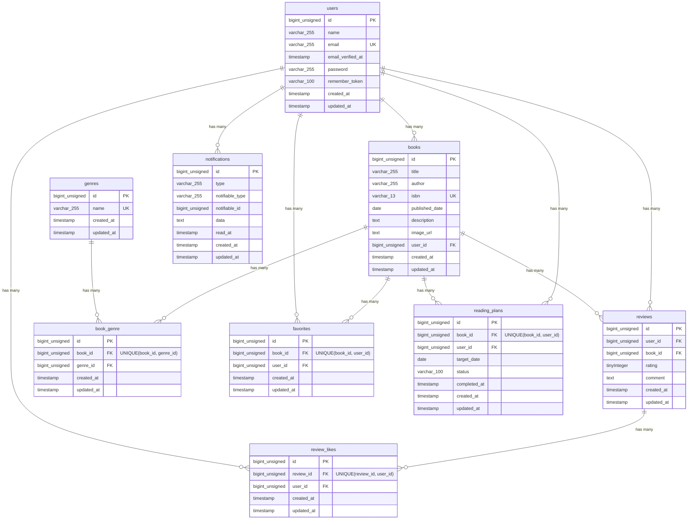

# COACHTECH 書籍レビューアプリ

本棚の機能を実装したLaravelプロジェクトです。
ゲスト(未ログイン)ユーザーと登録ユーザーで、それぞれ以下の機能を利用できます。

**ゲストユーザー**
* 書籍一覧、詳細画面の閲覧
* ランキング画面のアクセス

**登録ユーザー**
* 書籍の登録
* レビューの投稿(いいね機能付き)
* 書籍のお気に入り登録
* キーワード・ジャンル・並び順による検索
* マイ読書レポート・読書計画の管理
* 通知機能

## 作成者

緒方 あゆみ

## 使用技術

- PHP 8.2
- Laravel 10.x
- MySQL 8.0
- NginX
- Docker / Docker Compose / Laravel Sail
- Vite / Tailwind CSS 3.4
- Laravel Fortify (認証)
- phpMyAdmin
- Laravel Sanctum
- PHP Enum
- API連携 (Google Books APIとの連携)

## ER図



## 開発環境URL

http://localhost

## 動作環境

- Docker / Docker Compose
* Windowsの場合はWSL2の利用を推奨します。

## 環境構築手順

1. **リポジトリをクローン**

    ```bash
    git clone https://github.com/O-Ayumi/bookshelf-app.git
    cd bookshelf-app
    ```

2. **.envファイルの準備**

    `.env.example` をコピーして　`.env` を作成します。

    ```bash
    cp .env.example .env
    ```

    `.env` ファイル内の以下のDB接続情報を確認・設定します。
    `.env.example`のデフォルト値はSail向けではないため、以下のように変更してください。

    ```ini
    DB_CONNECTION=mysql
    DB_HOST=mysql
    DB_PORT=3306
    DB_DATABASE=laravel
    DB_USERNAME=sail
    DB_PASSWORD=password

    # ISBN検索機能を利用する場合、各自のGoogle APIキーを設定してください
    GOOGLE_BOOKS_API_KEY=your_api_key_here
    ```

3. **Composer依存パッケージのインストール**

    プロジェクトの初回セットアップ時は、 `vendor` ディレクトリが存在しないため `sail` コマンドを使用できません。
    以下のDockerコマンドを実行して、コンテナ内で `composer install` を実行します。

    ```bash
    docker run --rm \
    -u "$(id -u):$(id -g)" \
    -v "$(pwd):/var/www/html" \
    -w /var/www/html \
    -e COMPOSER_CACHE_DIR=/tmp/composer_cache \
    laravelsail/php82-composer:latest composer install
    ```

4. **Laravel Sailの起動**

    以下のコマンドでDockerコンテナを起動します。

    ```bash
    ./vendor/bin/sail up -d
    ```

    > **エイリアスの設定(推奨) **
    >
    > 毎回 `./vendor/bin/sail` と入力するのは手間なので、エイリアスを設定すると便利です。
    >
    > ```bash
    > alias sail='[ -f sail ] && bash sail || bash vendor/bin/sail'
    > ```

5. **アプリケーションキーの生成**

    ```bash
    sail artisan key:generate
    ```

6. **フロントエンドのビルド**

    ```bash
    sail npm install
    sail npm install alpinejs
    sail npm run dev
    ```

    `npm run dev` は開発中起動したままにしてください。

7. **データベースのマイグレーションと初期データ投入**

    以下のコマンドでテーブルを作成し、ダミーデータを投入します。

    ```bash
    sail artisan migrate:fresh --seed
    ```

    <details>
    <summary> `Access denied for user 'sail'` エラーが発生する場合</summary>

    このコマンドの入力後、下記のエラーが表示されることがあります。
    ```bash
       Illuminate\Database\QueryException 
      SQLSTATE[HY000] [1044] Access denied for user 'sail'@'%' to database 'bookshelf-app' (Connection: mysql, SQL: select table_name as `name`,         (data_length + index_length) as `size`, table_comment as `comment`, engine as `engine`, table_collation as `collation` from information_schema.tables where table_schema = 'bookshelf-app' and table_type in ('BASE TABLE', 'SYSTEM VERSIONED') order by table_name)

      at vendor/laravel/framework/src/Illuminate/Database/Connection.php:829
        825▕                     $this->getName(), $query, $this->prepareBindings($bindings), $e
        826▕                 );
        827▕             }
        828▕ 
      ➜ 829▕             throw new QueryException(
        830▕                 $this->getName(), $query, $this->prepareBindings($bindings), $e
        831▕             );
        832▕         }
        833▕     }

      +43 vendor frames 

      44  artisan:35
          Illuminate\Foundation\Console\Kernel::handle()
    ```
    このエラーはコンテナ内にデータが残っており、エラーが生じているケースなどがあります。
    その場合は、以下のコマンドを順に実行して各コンテナを再起動してください。
    ```Bash
    sail down -v
    sail up -d //コマンド実行後にSQLコンテナが立ち上がるまで時間がかかります。30秒ほどお待ちください。
    sail artisan migrate:fresh --seed
    ```
</details>


8. **アプリケーションへのアクセス**

    ブラウザで [http://localhost](http://localhost) にアクセスします。

## テスト実行

    テスト実行、日時パッチの動作確認のためログインユーザーを
    メールアドレス： `yamada@example.com`
    パスワード： `password`
    で設定してください。

    ```bash
    sail artisan test
    ```

    カバレッジ付きで実行する場合:

    ```bash
    sail artisan test --coverage
    ```

## 日時バッチ(通知・自動期限切れ)の実行

読書計画の期日に応じた自動通知や、ステータスの自動変更を行うバッチ処理です。
開発環境では実行されないため、**手動で以下のコマンドを実行してください。**
```bash
sail artisan app:send-timing-notifications
```

## 機能一覧

- ユーザー認証(登録、ログイン、ログアウト)
- 書籍登録・一覧取得・検索・詳細表示・編集・削除
- ISBN検索(外部API連携)
- 書籍のお気に入り追加(トグル処理)
- ジャンル名を登録・一覧表示・詳細表示・編集・削除
- 書籍詳細画面でレビュー表示・登録・編集
- レビューにいいねボタン(トグル処理)
- お気に入り書籍を一覧表示
- ランキング画面でレビュー平均のTOP10書籍を表示
- マイ読書レポートで基本サマリー、評価分布、高評価書籍TOP5、ジャンル別評価傾向TOP5を表示
- 読書計画一覧・登録・ステータス(状態)での絞り込み表示・編集・削除
- 読書計画一覧の読了ボタンで状態の更新
- 通知一覧表示・既読機能
- 日時パッチ(期日超過時の状態を自動的に変更)
- 公開API(Sanctum認証あり)書籍一覧・詳細・登録・更新・削除

## APIエンドポイント一覧

Sanctum認証を使った公開APIです。全エンドポイントは `/api/v1` プレフィックス配下に定義されています。

| HTTPメソッド | URI | 概要 |
|---|---|---|
| GET | /api/v1/books | 書籍一覧(検索・ページネーション付き) |
| GET | /api/v1/books/{book} | 書籍詳細(ジャンル・レビュー含む) |
| POST | /api/v1/books | 書籍の新規登録(Sanctum認証) |
| PUT | /api/v1/books/{book} | 書籍の更新(Sanctum認証) |
| DELETE | /api/v1/books/{book} | 書籍の削除(Sanctum認証) |

